## 使用开发工具制作主题

#### 前期准备

- 确保自己电脑安装有 android studio,并可正常使用 git 插件
- git 地址 https://gitee.com/helloworld_studio/dudu-launcher-theme
- 确保自己有下载 git 项目的能力

#### 制作流程

- 皮肤基础配置<br/>
  打开要修改的皮肤包(基于三个皮肤包之一即可)，找到如下两个文件
  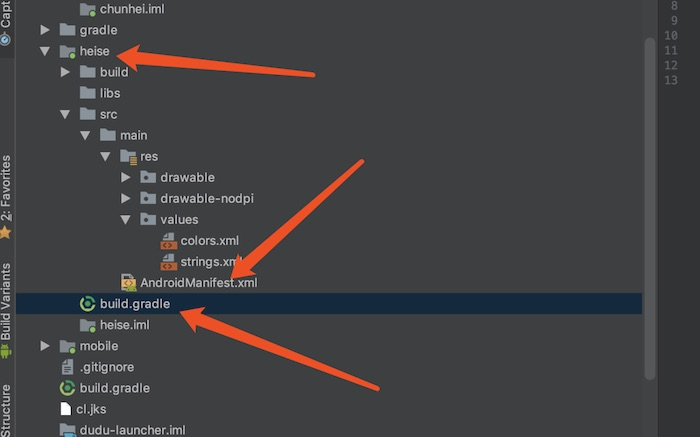
  打开 androidmanifest.xml，找到如图所示的字符位置，修改成自己特殊的字符，比如 com.wow.carlauncher.theme.shenqifeixia.skin1,记住一定要选择一个大家不会使用的字符做标记,而且一定要用 com.wow.carlauncher.theme.做前缀，不修改或者重复的标记，可能会和其他人的冲突,如下图
  
  打开 build.gradle，将图示的位置改成和上一步一样的字符,如下图
  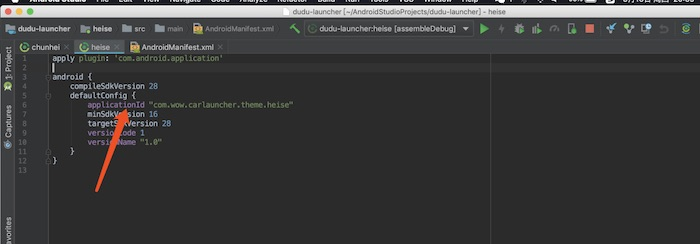
- 皮肤参数配置<br/>
  打开如图所示的 strings.xml 文件
  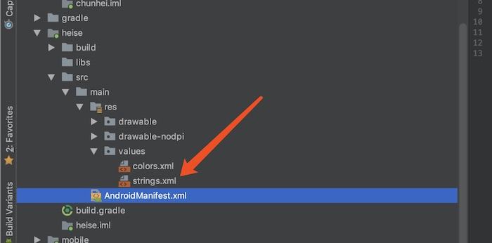
  内容如图所示，theme_name 是主题的名字，用于显示的，必须添加，其他属性可根据需求添加，不添加即采用默认值处理,如下图
  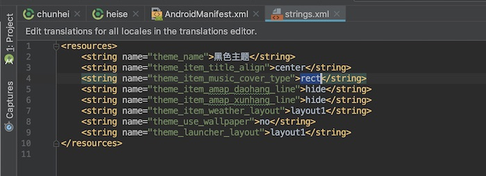
- 资源文件修改<br/>
  如图所示，这几个位置是资源目录位置，根据自己的要求修改即可，名字不能修改，drawable 目录下面的资源，可选择使用 xml 文件和图片文件，比如 theme_app_bg.xm 文件可以调换成 theme_app_bg.jpeg，两者只能存在一个，drawable-nodpi 目录下面的图片文件只能使用图片，不能替换成别的,资源文件修改参考 android 的开发规则,如下图
  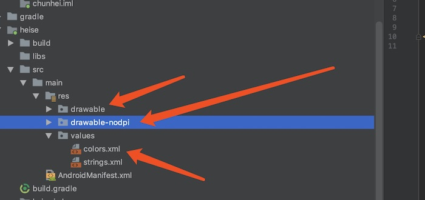
  这里如果图片文件过大,会导致卡顿,修改者自行处理

#### 打包流程

等待项目自动编译后
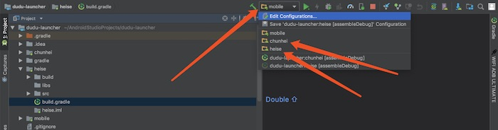
这个位置会出现三个单独的模块，chuihei,heise,baise
点击 Edit configurations
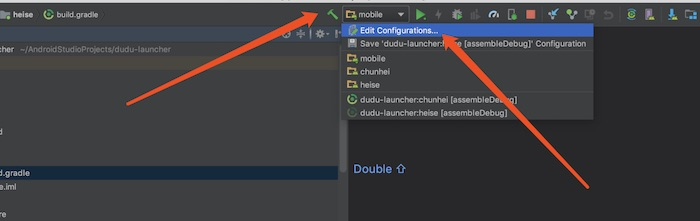
打开的对话框，修改 launch options 为 nothing，修改自己修改过的主题的
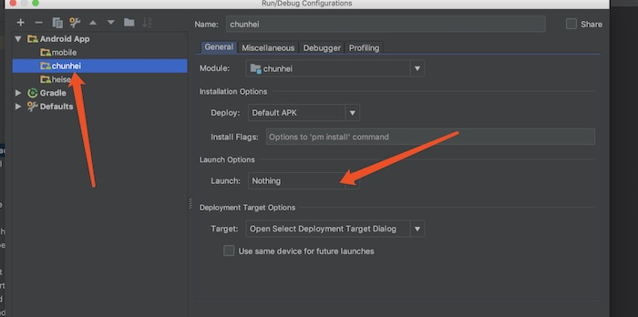
选择界面右边的 gradle,按照箭头所指，右击选择修改的模块的 assembledebug，右击选择运行
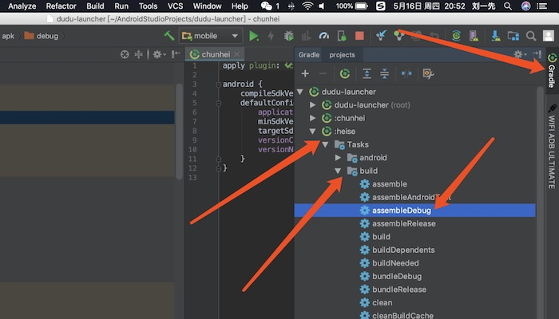
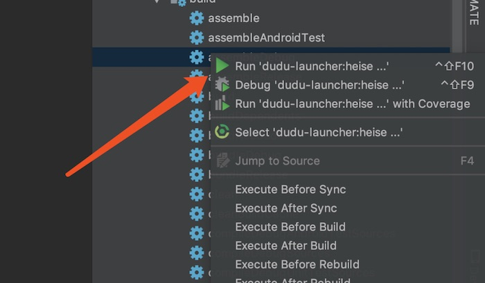
如图所示，目录下方出现一个 heise-debug.apk 文件

将这个文件改名成自己的名字，放到相应目录下，即可进行安装

## 使用反编译工具制作主题

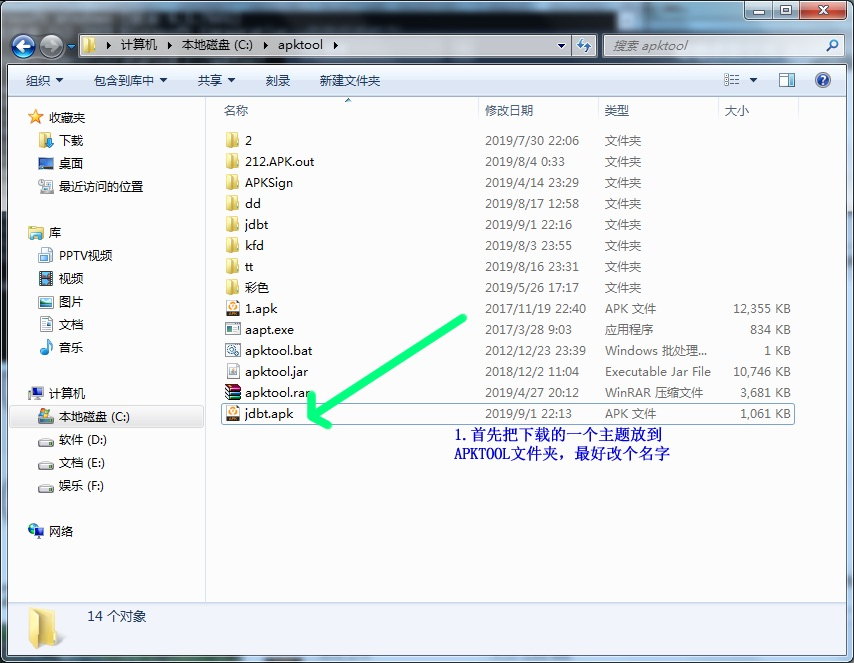

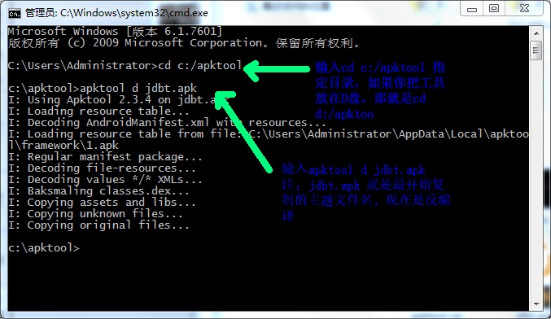
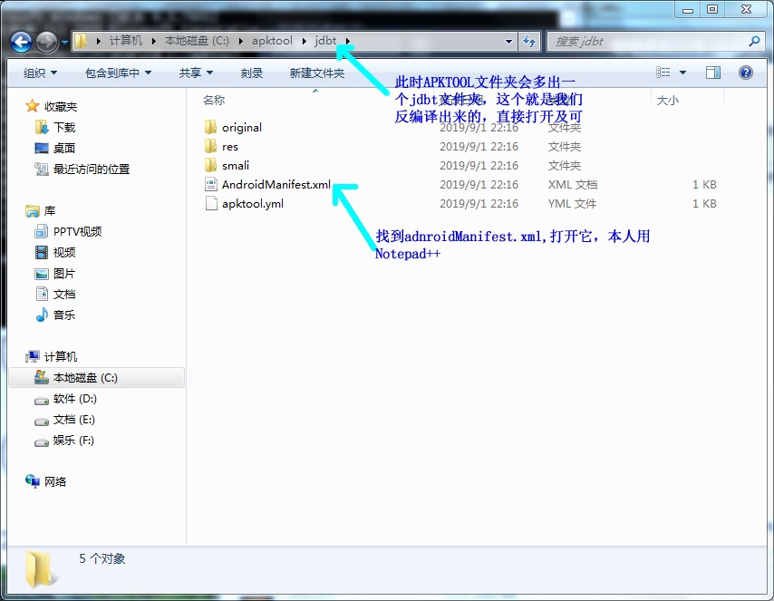
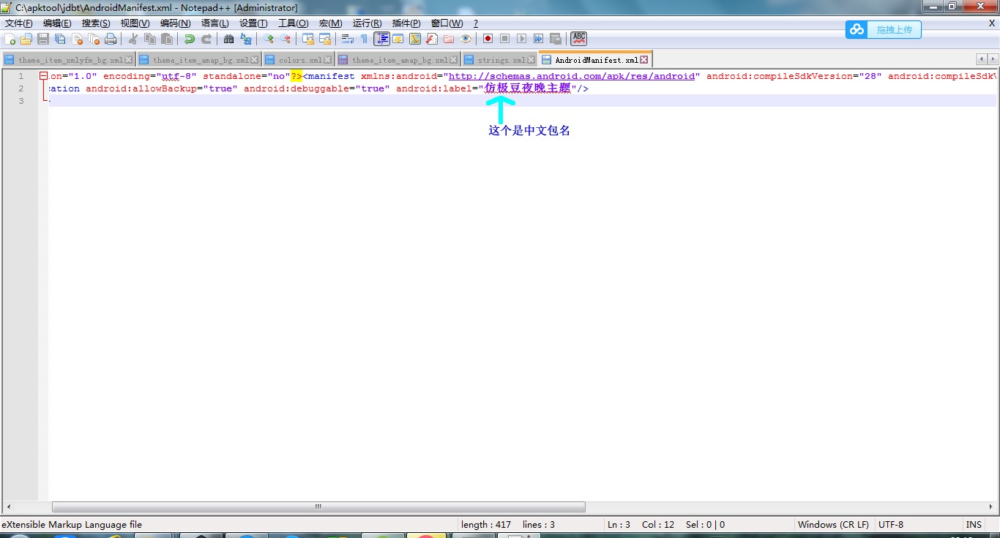
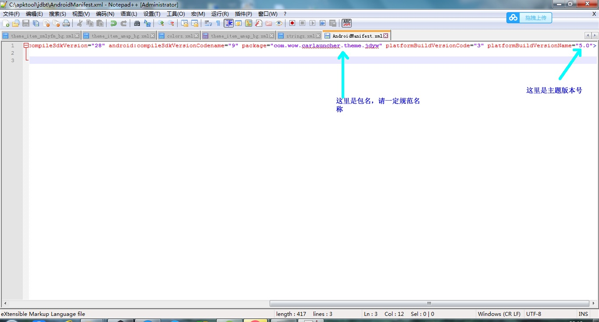
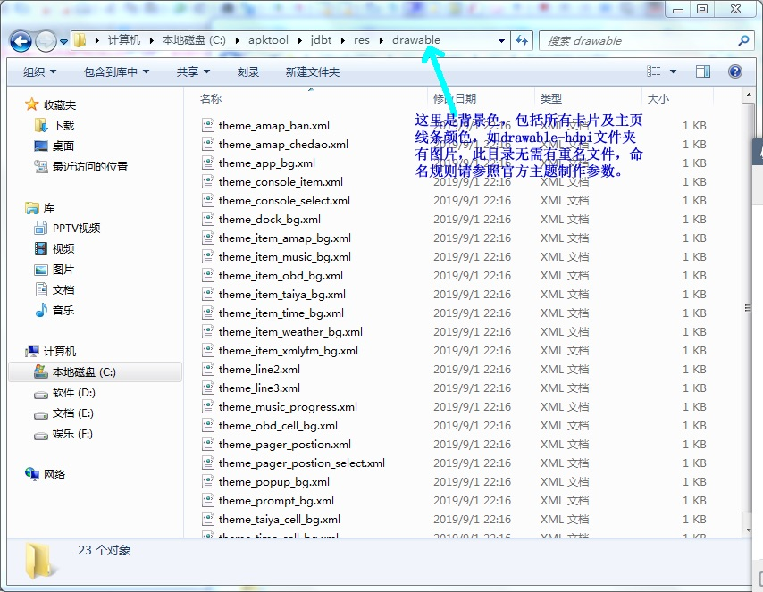
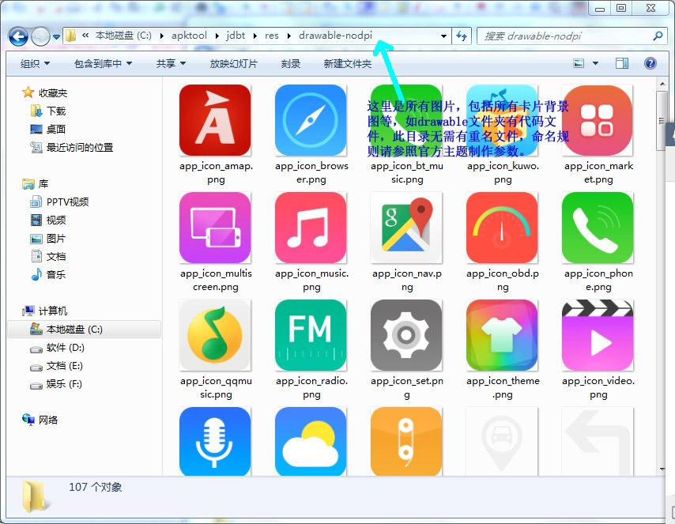
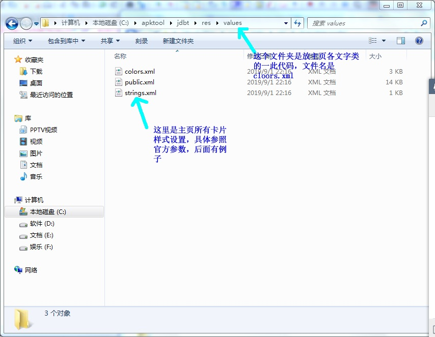
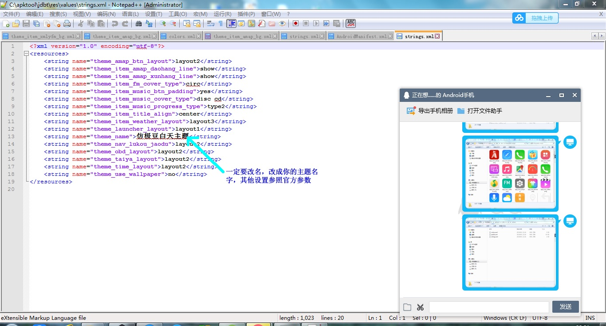
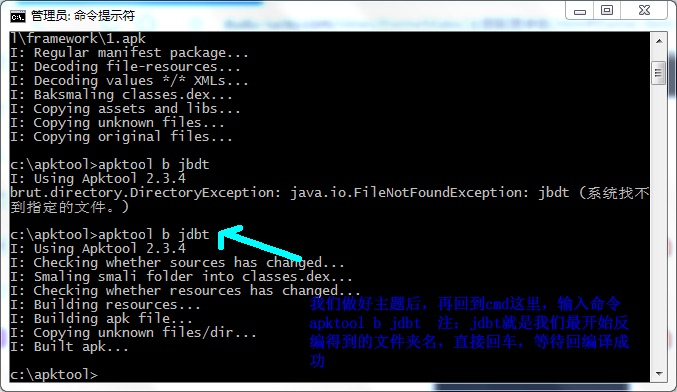
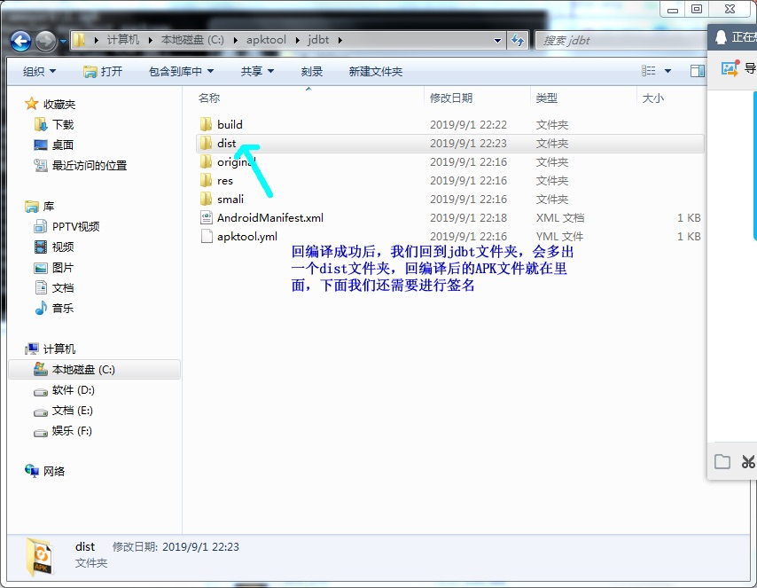
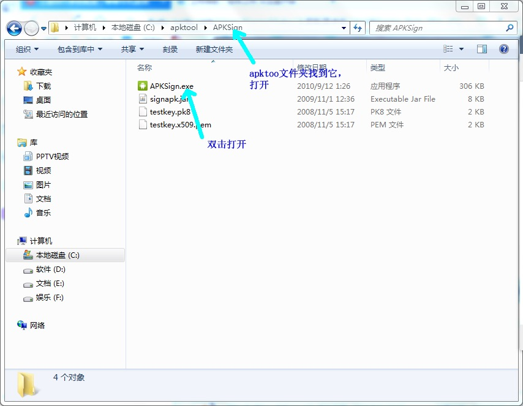

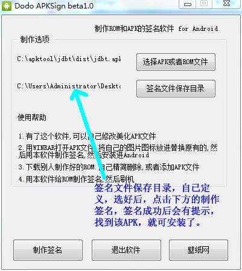

## 主题颜色配置

插件标题颜色<br/>

```
<color name="theme_item_title">#fbfbfb</color>
```

音乐标题颜色<br/>

```
<color name="theme_music_title">#fbfbfb</color>
```

音乐歌手颜色,歌词<br/>

```
<color name="theme_music_singer">#818796</color>
```

音乐标题颜色<br/>

```
<color name="theme_xmlyfm_title">#fbfbfb</color>
```

音乐歌手颜色,歌词<br/>

```
<color name="theme_xmlyfm_about">#818796</color>
```

限速文字颜色<br/>

```
<color name="theme_amap_xiansu">#fbfbfb</color>
```

剩余里程文字颜色<br/>

```
<color name="theme_amap_shengyulicheng">#fbfbfb</color>
```

下个路口距离颜色<br/>

```
<color name="theme_amap_next_dis">#fff</color>
```

下个路口名称颜色<br/>

```
<color name="theme_amap_next_road">#ddd</color>
```

速度颜色<br/>

```
<color name="theme_amap_speed">#fff</color>
```

天气布局 1 相关的颜色<br/>

```
<color name="theme_weather_1_tianqi">#9ba1a9</color>
<color name="theme_weather_1_wendu">#697185</color>
<color name="theme_weather_1_city">#697185</color>
<color name="theme_weather_1_name">#9ba1a9</color>
<color name="theme_weather_1_value">#333e54</color>
```

天气布局 2 相关的颜色<br/>

```
<color name="theme_weather_2_wendu">#fbfbfb</color>
<color name="theme_weather_2_tianqi">#fbfbfb</color>
<color name="theme_weather_2_name">#848a95</color>
<color name="theme_weather_2_value">#aaa</color>
```

obd 信息颜色<br/>

```
<color name="theme_obd_info">#fbfbfb</color>
<color name="theme_obd_msg">#adadad</color>
```

胎压信息颜色<br/>

```
<color name="theme_taiya_info">#fbfbfb</color>
<color name="theme_taiya_msg">#adadad</color>
```

时间信息颜色<br/>

```
<color name="theme_time_shijian">#fbfbfb</color>
<color name="theme_time_week">#adadad</color>
<color name="theme_time_day">#adadad</color>
<color name="theme_time_lunar">#adadad</color>
```

dock 的标题颜色<br/>

```
<color name="theme_dock_title">#fbfbfb</color>
```

APP 列表标题颜色<br/>

```
<color name="theme_app_name">#adadad</color>
```

托盘时间颜色<br/>

```
<color name="theme_prompt_time">#fbfbfb</color>
```

控制台相关颜色<br/>

```
<color name="theme_console_appname">#fbfbfb</color>
<color name="theme_console_time">#fbfbfb</color>
<color name="theme_console_music_title">#fbfbfb</color>
```

语音助手相关颜色<br/>

```
<color name="theme_voice_message">#fbfbfb</color>
```

歌词颜色(高亮)<br/>

```
<color name="theme_lrc_hit">#e62d4f</color>
```

歌词颜色(正常)<br/>

```
<color name="theme_lrc_normal">#818796</color>
```

状态栏颜色<br/>

```
<color name="theme_state_bar_color">#ff251f4b</color>
```

## 主题图标匹配

#### 匹配方式 1,内置匹配,性能好,支持的图标少

现已支持以下应用:<br/>

- QQ 音乐车机版:R.drawable.app_icon_qqmusic
- NWD 音乐:R.drawable.app_icon_music
- 安卓原生音乐:R.drawable.app_icon_music
- NWD 蓝牙音乐:R.drawable.app_icon_bt_music
- autochips 蓝牙音乐:R.drawable.app_icon_bt_music
- 酷我车机版:R.drawable.app_icon_kuwo
- 嘟嘟音乐:R.drawable.app_icon_music
- NWD 电话:R.drawable.app_icon_phone
- 酷我车机版:R.drawable.app_icon_kuwo
- 嘟嘟音乐:R.drawable.app_icon_music
- 原生电话应用:R.drawable.app_icon_phone
- NWD 收音机:R.drawable.app_icon_radio
- 高德导航:R.drawable.app_icon_amap
- 浏览器:R.drawable.app_icon_browser
- ES 浏览器:R.drawable.app_icon_browser
- 掌讯收音机:R.drawable.app_icon_radio

#### 匹配方式 2,资源名称匹配,性能差,支持所有应用

将图标放置 drawable 文件夹,以 aicon\_前缀,将包名的.替换成\_即可<br/>
比如 QQ 音乐车机版,包名为 com.tencent.qqmusiccar,资源名称就是 aicon_com_tencent_qqmusiccar.jpeg<br/>
注意:此种匹配方式必须重新编译打包!!!

## 主题制作参数配置

#### 主题名称

参数名 :theme_name<br/>
主题准备显示的名称,作者自定义即可,不要和大家的主题冲突就可以

#### 作者名称

参数名 :theme_author<br/>
主题作者的名称

#### 插件标题位置

参数名 :theme_item_title_align<br/>
对于带有标题的插件,可自定义位置,可选以下值,默认居中

- center 居中
- left 居左
- right 居右

#### 音乐封面类型

参数名 :theme_item_music_cover_type<br/>
可选以下值,默认 circ 圆形封面

- circ 圆形
- rect 圆角矩形
- disc 类似 CD 的封面

#### 音乐进度条类型

参数名 :theme_item_music_progress_type<br/>
可选以下值,默认 type1

- type1 普通进度条样式
- type2 带滑块的进度条样式

#### 音乐按键加内边距

参数名 :theme_item_music_btn_padding<br/>
可选以下值,默认 no

- no 不加
- yes 加

#### FM 封面类型

参数名 :theme_item_fm_cover_type<br/>
可选以下值,默认 circ 圆形封面

- circ 圆形
- rect 圆角矩形

#### 导航插件某根线是否显示

参数名 1 :theme_item_amap_daohang_line<br/>
参数名 2 :theme_item_amap_xunhang_line<br/>
默认 show,位置自测

- hide 隐藏
- show 显示

#### 天气插件的布局

参数名 :theme_item_weather_layout<br/>
可选以下值,默认 layout1,样式自测

- layout1
- layout2
- layout3

#### 是否使用墙纸

参数名 :theme_use_wallpaper<br/>
可选以下值,默认 no

- no 不使用
- yes 使用

#### 首页推荐布局

参数名 :theme_launcher_layout<br/>
用户可覆盖此设置,推荐用,可选以下值,默认 layout1

- layout1 此布局 dock 在左边,托盘在底部
- layout2 此布局 dock 在底部,托盘在顶部

#### 高德导航插件控制按钮布局

参数名 :theme_amap_btn_layout<br/>
可选以下值,默认 layout1

- layout1 不均匀分布
- layout2 均匀分布

#### 时间插件的布局

参数名 :theme_time_layout<br/>
可选以下值,默认 layout1,样式自测

- layout1 电子表布局
- layout2 时钟布局

#### OBD 插件的布局

参数名 :theme_obd_layout<br/>
可选以下值,默认 layout1,样式自测

- layout1
- layout2

#### 胎压插件的布局

参数名 :theme_taiya_layout<br/>
可选以下值,默认 layout1,样式自测

- layout1
- layout2

#### 路口箭头的角度

参数名 :theme_nav_lukou_jaodu<br/>
默认 0,数字即可

#### 隐藏首页页面标记

参数名 :theme_launcher_postion_show<br/>
可选以下值,默认 show

- hide 隐藏
- show 显示

#### 导航插件的布局

参数名 :theme_nav_layout<br/>
可选以下值,默认 layout1,样式自测

- layout1
- layout2

#### 音乐插件的圆角大小

参数名 :theme_music_mini_radius<br/>
默认 16,数字即可

#### 音乐插件是否使用封面

参数名 :theme_music_mini_use_cover<br/>
默认 yes

- no 不使用
- yes 使用

#### MINI 时间插件的布局

参数名 :theme_time_mini_layout<br/>
可选以下值,默认 layout1,样式自测

- layout1
- layout2

## 主题分享

- 打开嘟嘟桌面 APP,登陆后在个人中心绑定邮箱
- 浏览器打开https://app.dudu-lucky.com/#/user/login,使用绑定的邮箱进行登陆
