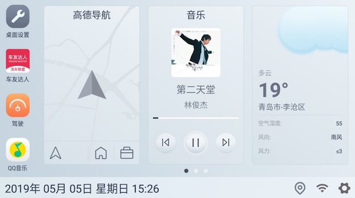

# 首页主题

首页可调整布局方案,主题方案,选项卡数量,切换动画

## 布局

首页提供两个布局方案

- 布局 1,dock 在左,托盘在下(如下图)

- 布局 2,dock 在下,托盘在上(如下图)

## 主题

首页提供三个主题方案,同时支持日出日落切换,大灯状态切换主题(需要底层支持)

- 白色主题(如下图)

- 黑色主题(如下图,需安装)

- 酷黑主题(如下图,需安装)

