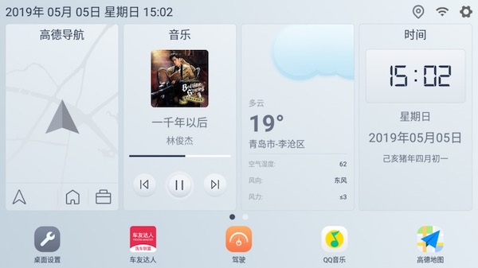

## 首页布局,现在提供三种布局方案

- 使用皮肤内置的布局

- 布局 1,dock 在左,托盘在下(如下图)
  
- 布局 2,dock 在下,托盘在上(如下图)
  

## 切换动画

app 提供了 10 多种切换动画可供选择

## 首页插件调整

- 调整首页插件的显示,也可以对插件进行隐藏
- 可选择首页插件的数量,适配超宽屏幕(4 个插件),超窄屏幕(2 个插件)
- 可隐藏托盘区
- 可隐藏 DOCK
- 可调整时间格式
