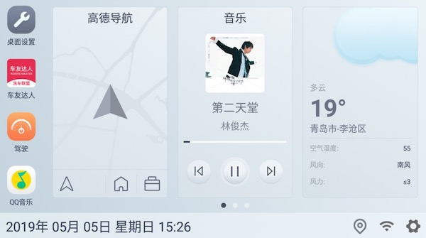
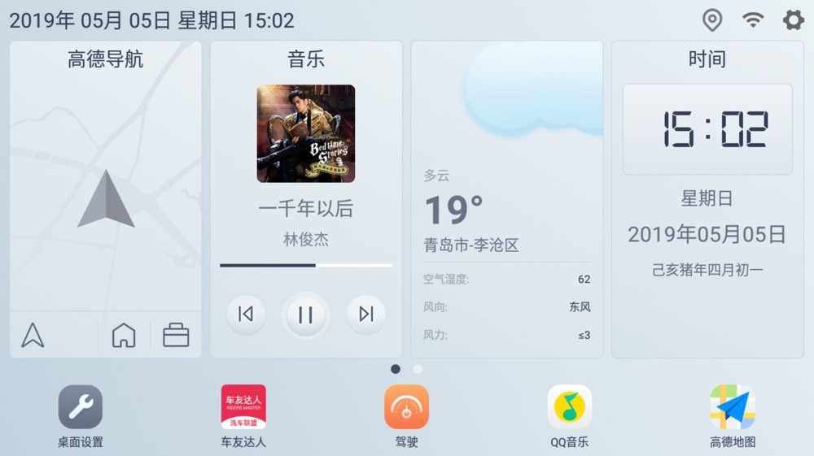

桌面设置的说明文档，不定期更新

<!-- more -->

## 内置功能

部分内容功能的快捷入口,同时可关闭部分内置功能

## 常用设置-首页

- 首页皮肤-皮肤切换模式,三个模式 
  固定主题,固定为主皮肤,不会自定切换 
  根据灯光切换,诺威达某些车机支持,开灯时候使用夜间皮肤,不开灯使用主皮肤 
  根据日出日落切换,根据定位信息和日期,计算日出日落时间,进行皮肤切换,会有一定延迟
- 首页皮肤-APP 图标自定义,将部分 APP 的图标强制替换成某些图片,会忽略 APP 自身图标以及主题内置图标
- 切换动画-首页切换动画,更换首页滑页时候的动画
- 首页插件-插件顺序,调整首页插件的顺序以及展示情况,拖动条目最后的按钮可改变排序
- 首页插件-插件顺序重置,将首页插件的顺序重置为默认
- 首页插件-插件数量,调整首页的插件数量,有的车机屏幕比较长,需要多个插件,还有的车机插件稍微少一些,由用户自己决定合适的插件数量
- 首页插件-卡片间隔,首页卡片的间隔,根据自己需求调整,默认小
- 首页插件-托盘日期格式,托盘日期显示的格式,遵循 java 日期规范,不懂的自行百度
- 首页警告-超速警告,打开后,桌面发现超速行为,整个屏幕会变红,警告基于高德地图车机版
- 首页警告-胎压警告,打开后,桌面发现胎压不足,整个屏幕会变红,警告范围值由用户定义
- 首页警告-油量警告,打开后,桌面发现油量不足,整个屏幕会变红,警告范围值由用户定义

- 首页布局-首页布局,三个模式: 
  使用主题布局(参考主题中的设置) 
  布局 1,dock 在左,托盘在底部 
  
  布局 2,dock 在底部,托盘在顶部 
  
- 首页布局-是否展示托盘区,隐藏和显示托盘栏,隐藏并不会有性能提升,只是看不见而已,默认显示
- 首页布局-是否展示 DOCK,隐藏和显示 DOCK,隐藏并不会有性能提升,只是看不见而已,默认显示
- 首页布局-是否展示页面标记,隐藏和显示页面标记,隐藏并不会有性能提升,只是看不见而已,默认显示
- 首页配置-是否全屏,是否隐藏状态栏,默认全屏
- 首页配置-是否强制使用壁纸,打开后,会显示系统设置的壁纸
- 首页配置-登陆后是否显示托盘头像,打开后托盘会显示登陆用户的头像
- 首页配置-DOCK 滑动音量调节,类似极豆的 DOCK 的上下滑动调节音量功能
- 首页配置-DOCK 标签文字展示,关闭后不显示 DOCK 的 APP 的名称标签

## 常用设置-插件设置

- 音乐插件-音乐播放器控制器 [参考音乐播放器设置](/views/course/桌面插件)
- 音乐插件-音乐播放器内置封面,对于有封面的音乐播放器,是否使用播放器提供的封面,比如 QQ 音乐,酷我之类的,如果不适用,桌面会自行下载封面
- 音乐插件-显示歌词,控制桌面是否显示歌词,显示的话,歌名和歌手会合并成一行,各自单独占一行
- 音乐插件-歌词行数,首页歌词的行数,默认 10 行,更改后,下次加载歌词生效
- 音乐插件-封面使用 CD 效果,如果性能不足,可关闭音乐插件的 CD 效果
- 音乐插件-APP 开启最后的活动,桌面会记录最后一次使用的 APP(音乐或者 FM),下次启动继续播放
- 音乐插件-APP 开启最后的活动延迟,上一个条目,启动继续播放的延迟,从启动到发起最后一次活动请求的间隔
- 酷我特殊设置-自动执行播放命令,这个和酷我播放器同时使用,在打开酷我播放器的时候,会调用播放指令
- 酷我特殊设置-自动开启,使用酷我协议的时候,如果没有检测到酷我存活,可以自动打开酷我
- 酷狗特殊设置-插件支持,选择酷狗的桌面插件(4\*4)
- 天气插件-天气定位,对于没有 GPS 信号的车机,直接固定某个市区
- 导航插件-导航插件协议,选择高德车机版或者百度车机版
- 高德插件-导航最小触发间隔,默认值 0(无间隔),设置 10,导航信息会强制延迟到 100 毫秒(10\*10)的间隔进行触发,可能会有信息无法看见,但是可以有效缓解低配车机卡顿问题
- 高德插件-不导航时使用巡航,巡航可显示速度和超速提示(基于高德数据)
- 高德插件-打开路况功能,导航时候显示路况信息到桌面
- 高德插件-打开车道功能,导航时候显示车道信息到桌面
- 高德插件-车道信息和路面平行,一个比较炫酷的车道展示效果
- 高德插件-导航弹出窗,临近路口时候(200 米以内),可弹出来高德的导航地图,需要高德桌面插件支持(不稳定,车机版高德桌面插件可能不刷新,需自测)
- 高德插件-桌面插件,选择高德桌面插件(4\*3),用来支持导航弹出窗的信息
- 高德插件-同步昼夜主题至高德,如果车机不控制高德的主题,可由嘟嘟桌面控制
- 底层协议-控制层协议,对于某些车机,嘟嘟桌面可直接操作和获取底层信息,比如部分诺威达和掌讯,可实现灯光切换主题,蓝牙方控接电话等功能

## 常用设置-驾驶界面设置

- 驾驶界面-界面来源,内置还是第三方 APP
- 驾驶界面-打开的 APP,设置来源为第三方 APP 的时候,可在此处设置打开的 APP,在唤醒驾驶界面的时候,改为唤醒这个 APP
- 驾驶界面-内置驾驶界面类别,设置内置的驾驶界面,3 个可供选择 
  酷黑,需要 OBD 支持,显示内容包括车况,胎压,导航,音乐 
  魅力蓝调, OBD 支持更佳,显示内容包括车况,胎压,导航,音乐 
  时间待机,只显示时间
- 界面设置-启动动画,对于某些驾驶界面,可使用启动动画
- 跳转方式-是否自动跳转,是否自动跳转到驾驶界面
- 跳转方式-自动跳转方式,时间还是根据转速(OBD)跳转
- 跳转方式-时间间隔,如果是时间的话,多长时间跳转到驾驶界面

## 外设-HUD

- hud 类别,当前 HUD 设备是那种设备,现在只支持车萝卜蓝牙版
- hud 蓝牙绑定-绑定,绑定的蓝牙 HUD 的 mac 地址,只有需要绑定蓝牙的 HUD 才有效
- hud 蓝牙绑定-断开,断开和清理绑定信息
- 车萝卜蓝牙 hud -自动亮度,开启 HUD 的自动亮度功能
- 车萝卜蓝牙 hud -选择亮度,HUD 的亮度级别,三个级别,自己体会
- 车萝卜蓝牙 hud -速度补偿,HUD 速度补偿功能,OBD 速度比仪表盘要慢一些,这个功能是为了让速度同步

## 外设-OBD

- OBD 类别,当前 OBD 设备是那种设备,现在支持优驾高级版,优驾胎压版
- OBD 蓝牙绑定-绑定,绑定的蓝牙 OBD 的 mac 地址,只有需要绑定蓝牙的 OBD 才有效
- OBD 蓝牙绑定-断开,断开和清理绑定信息
- OBD 油量警告百分比,低于这个百分比,并且警告功能已经打开,则会触发警告

## 外设-胎压

- 胎压类别,当前胎压设备是那种设备,现在支持优驾胎压版,车装甲,A800V 版本原车胎压
- 胎压警告值,低于或者高于设置值,并且警告功能已经打开,则会触发警告
- 胎压调换,自行调换胎压位置

## 外设-方控

- 方控类别,当前方控设备是那种设备,现在支持多种方控 
  亿连方控:蓝牙方控,功能最全 
  长安方控,吉利方控,迈锐宝方控,只支持切歌
- 方控蓝牙绑定-绑定,绑定的蓝牙方控的 mac 地址,只有需要绑定蓝牙的方控才有效
- 方控蓝牙绑定-断开,断开和清理绑定信息
- 亿连方控配置-方控通道,亿连方控版本不同,通道不一样,这里自行设置

## 其他设置-定时检测

- 蓝牙设备检测,打开后,一定时间会检测蓝牙外设是否都已经连接,如果没有连接,则会重启蓝牙,支持 OBVD,HUD,方控三个外设
- WIFI 检测,打开后,如果一定时间没有联网,会强制连接某个 wifi

## 其他设置-计划任务

暂时不提供教程

## 其他设置-系统

- APP 设置-默认桌面,就是设置系统的默认桌面,防止有车友找不到地方设置,这个功能可能被系统精简掉
- APP 设置-使用官方方式返回桌面,如果启动无法返回嘟嘟桌面,建议关闭这个开关尝试一下
- APP 设置-首次使用教程,第一次打开嘟嘟桌面的教程
- APP 设置-首页显示挂载入口,就是首页显示图标直接跳转到系统挂载界面
- APP 设置-桌面隐藏项目,选中后,APP 就不会在桌面显示了
- APP 设置-监听开机命令打开嘟嘟桌面,关闭后,如果没有设置嘟嘟桌面,则嘟嘟桌面不唤醒
- 检查权限-检查权限是否足够,手动检查权限功能
- 检查权限-检查 ROOT 权限,手动检查 ROOT 功能
- 检查权限-启动 APP 检查权限,打开 APP 的时候,自动检查权限是否足够
- 检查权限-启动 APP 检查 ROOT 权限,打开 APP 的时候,自动检查是否 ROOT
- 版本更新-检查更新,查找服务器的更新
- 版本更新-启动检查更新,打开后,每天启动都会自动检查更新
- 关于,就是关于了
