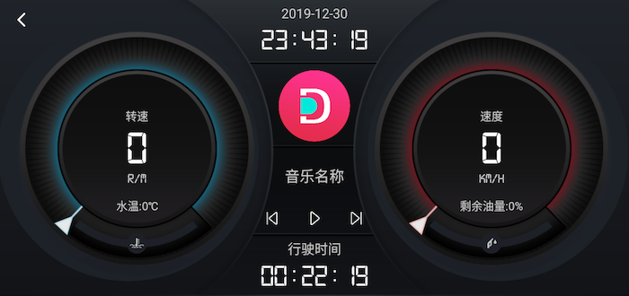
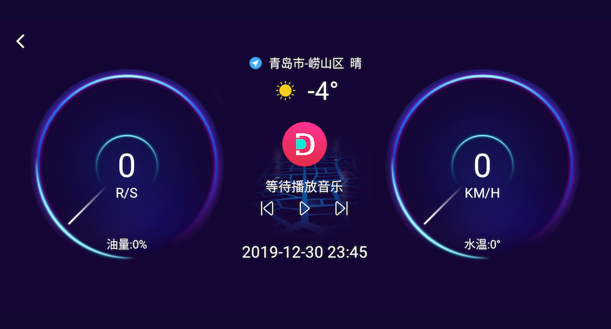
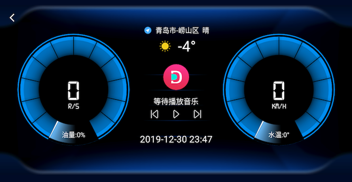
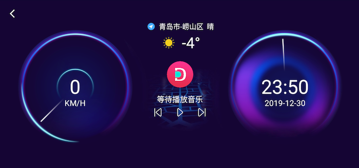
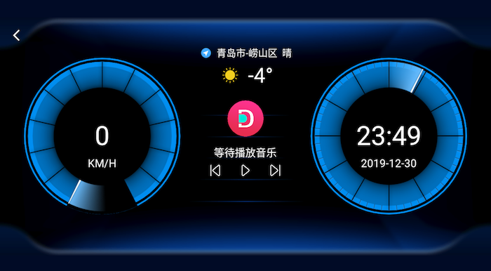
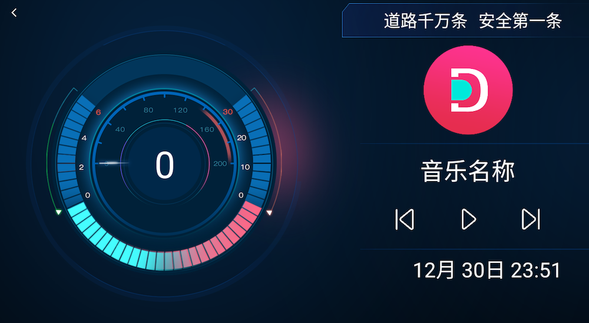

桌面支持 7 个风格的驾驶界面，包括带有各种车况信息的仪表盘风格，或者是只显示待机图像和时间的简约风格

<!-- more -->

## 如何使用驾驶界面

进入`设置-驾驶界面`可查看当前使用的驾驶界面,点击桌面驾驶图标即可进入 
使用`设置-计划任务`,可选择在某个时间点,或者某个速度自动进入驾驶界面,具体参见[设置说明](/views/course/设置)

## 驾驶界面类型

驾驶界面分为以下 3 种类型

### 需要 OBD 支持

需要 OBD 支持,才能显示数据,如果无 OBD(车况)支持,则数据不会显示

#### 酷黑仪表盘

可显示 OBD 基本数据,音乐,胎压,导航信息,如下图所示

#### 紫色仪表 OBD 版本

可显示 OBD 基本数据,音乐,时间,导航,天气信息,如下图所示

#### 蓝色仪表 OBD 版本

可显示 OBD 基本数据,音乐,时间,导航,天气信息,如下图所示

### 不需要 OBD 支持

基于掌讯版本车机底层控制命令,实现音量控制,大灯状态,点火事件

#### 紫色仪表基础

可显示音乐,导航,天气信息,时间,如下图所示

#### 蓝色仪表基础

可显示音乐,导航,天气信息,时间,如下图所示

#### 时间

仅显示时间,可自行调整背景

### OBD 显示更佳

需要 OBD 支持,如果没有 OBD 支持,也可以显示数据

#### 魅力蓝调

可显示 OBD 基本数据,音乐,胎压,导航信息,如下图所示

