## 前期准备

- 确保自己电脑安装有 android studio,并可正常使用 git 插件
- git 地址 https://gitee.com/helloworld_studio/dudu-launcher-theme
- 确保自己有下载 git 项目的能力

## 制作流程

- 皮肤基础配置 
  打开要修改的皮肤包(基于三个皮肤包之一即可)，找到如下两个文件
  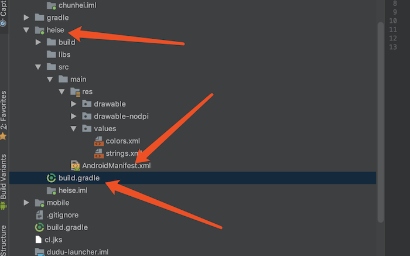
  打开 androidmanifest.xml，找到如图所示的字符位置，修改成自己特殊的字符，比如 com.wow.carlauncher.theme.shenqifeixia.skin1,记住一定要选择一个大家不会使用的字符做标记,而且一定要用 com.wow.carlauncher.theme.做前缀，不修改或者重复的标记，可能会和其他人的冲突,如下图
  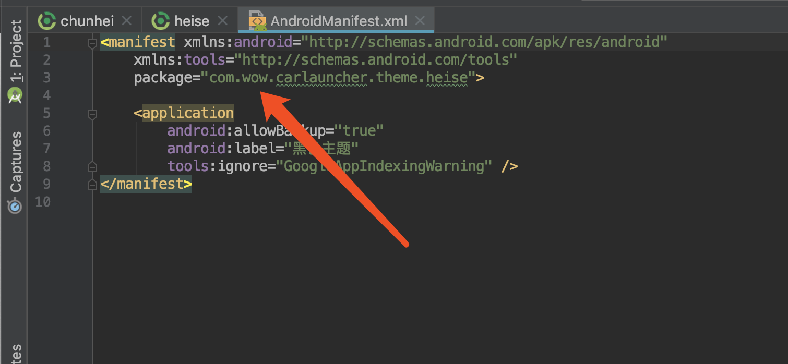
  打开 build.gradle，将图示的位置改成和上一步一样的字符,如下图
  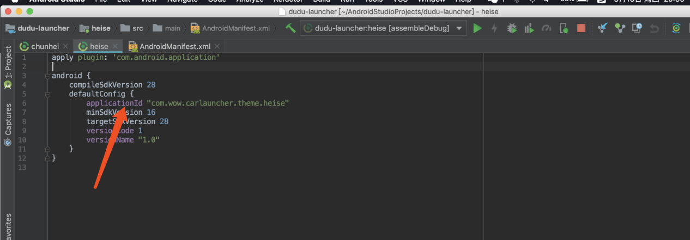
- 皮肤参数配置 
  打开如图所示的 strings.xml 文件
  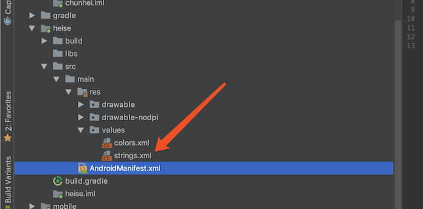
  内容如图所示，theme_name 是主题的名字，用于显示的，必须添加，其他属性可根据需求添加，不添加即采用默认值处理,如下图
  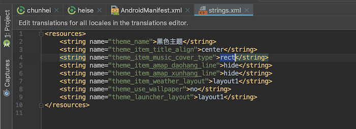
- 资源文件修改 
  如图所示，这几个位置是资源目录位置，根据自己的要求修改即可，名字不能修改，drawable 目录下面的资源，可选择使用 xml 文件和图片文件，比如 theme_app_bg.xm 文件可以调换成 theme_app_bg.png，两者只能存在一个，drawable-nodpi 目录下面的图片文件只能使用图片，不能替换成别的,资源文件修改参考 android 的开发规则,如下图
  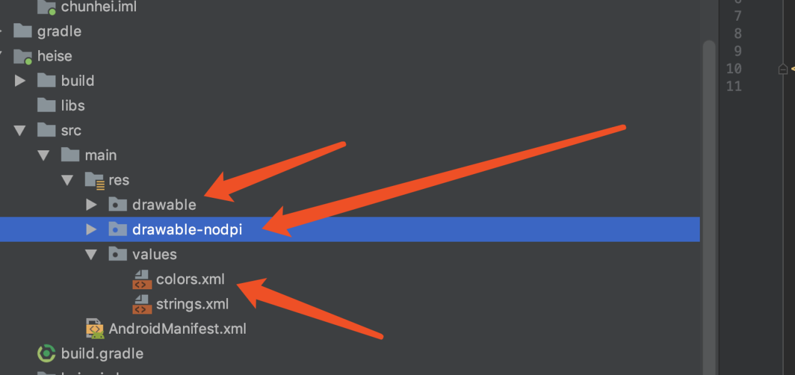
  这里如果图片文件过大,会导致卡顿,修改者自行处理

## 打包流程

等待项目自动编译后
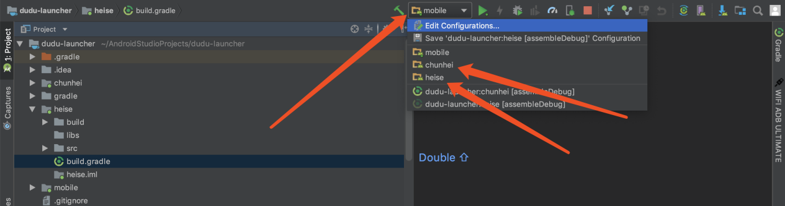
这个位置会出现三个单独的模块，chuihei,heise,baise
点击 Edit configurations
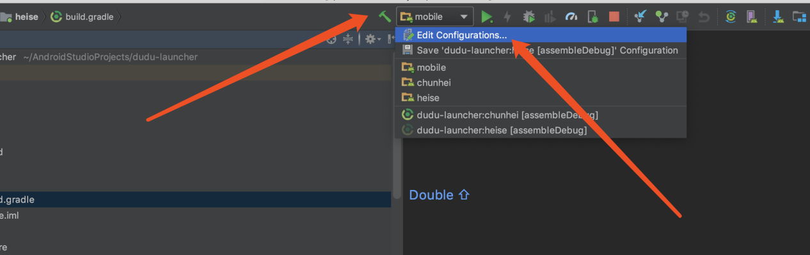
打开的对话框，修改 launch options 为 nothing，修改自己修改过的主题的
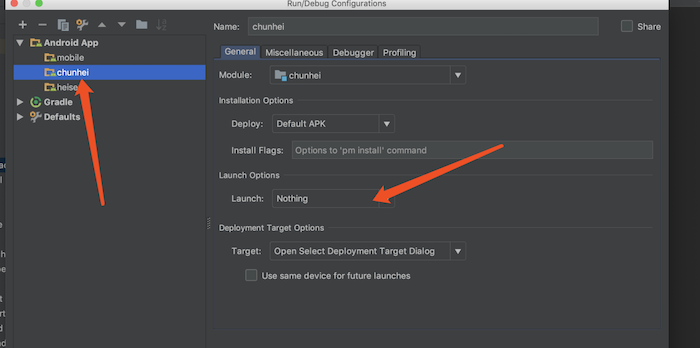
选择界面右边的 gradle,按照箭头所指，右击选择修改的模块的 assembledebug，右击选择运行
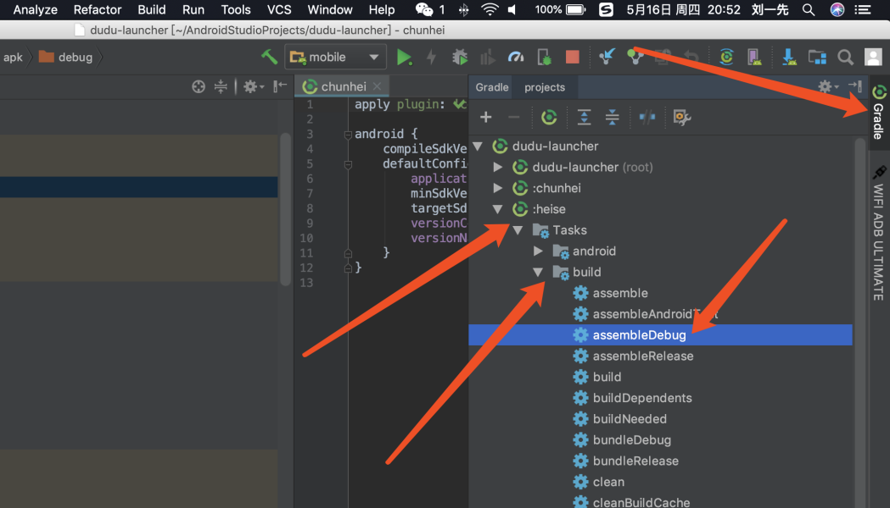
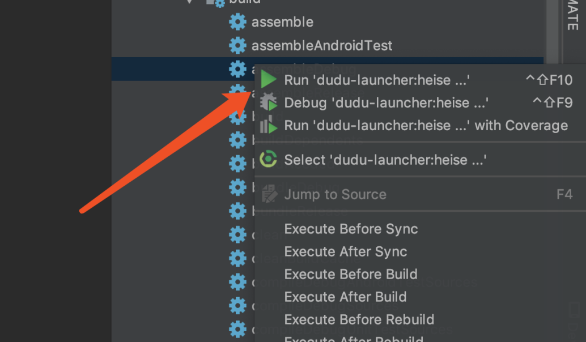
如图所示，目录下方出现一个 heise-debug.apk 文件

将这个文件改名成自己的名字，放到相应目录下，即可进行安装
